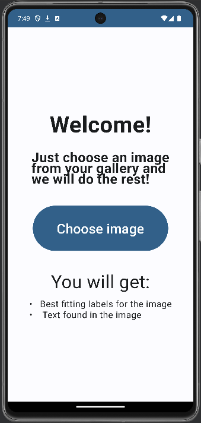
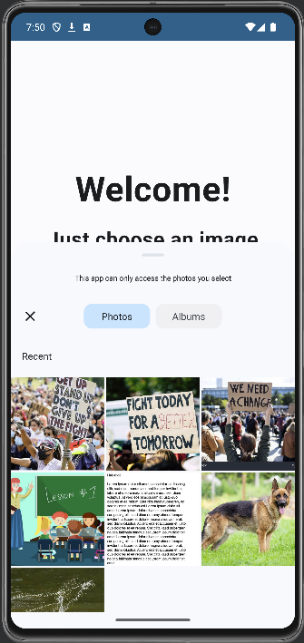
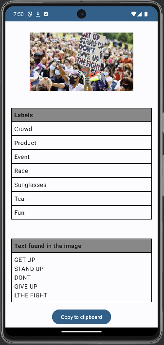

# ImagesLabeling for Android
Android app with Kotlin Jetpack Compose Frontend and Java backend. Just choose an image from your gallery and get most porper labels and tezt from the image

## Screenshots

